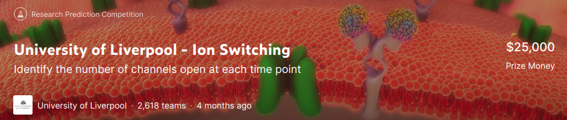
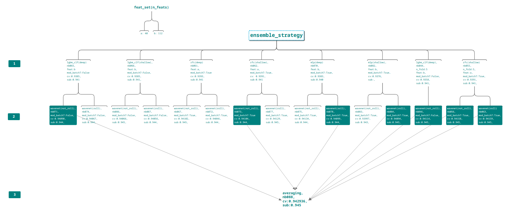

# [Kaggle] University of Liverpool - Ion Switching

## Todo
- [x] isSmallSet の作成。今回は、それぞれのバッチから最初の数レコード取ってくるような使用にする。
- [x] f1_score macro について理解する
- [x] objective huberについて調べる
- [x] cpu の制御する
- [x] バッチそれぞれで学習させてそれぞれでスコア出してみる
- [x] get_batch_df の実装
- [x] batch7を見ると、signal-signal_movingとかすごい良いんじゃないかと思う
- [x] moving std も入れる
- [x] 値の変動が大きい(signal-(signal_mv+signal_mv_std)>0)という特徴量
- [x] ラグ特徴量を使う
- [x] 一つ前との差を特徴量とする
- [x] oof も保存するようにする
- [x] stratified k fold を使う
- [x] このノートブックのFEを真似する([FE and ensemble MLP and LGBM /| Kaggle](https://www.kaggle.com/martxelo/fe-and-ensemble-mlp-and-lgbm))
- [x] signal だけで推論してみる
- [x] pandas ewm を調べる
- [x] comfusion matrix入れる
- [x] reduce_mem_usageを入れる(時間も表示するようにする)
- [x] train_test_splitの関数も作る
- [x] 相関の高い特徴量を調査し、除く。
- [ ] adversarial varidation
- [x] ひとまずlightGBMだけで0.94に到達する
- [x] 0を分離する閾値を調査する
- [x] randomforest でかなりシンプルに0.94出してる？([SHIFTED-RFC Pipeline /| Kaggle](https://www.kaggle.com/sggpls/shifted-rfc-pipeline))
- [x] wavenet を試してみる([Wavenet with SHIFTED-RFC Proba and CBR /| Kaggle](https://www.kaggle.com/nxrprime/wavenet-with-shifted-rfc-proba-and-cbr))
- [ ] boruta 使う
- [x] nb021を特徴量減らす(相関とかで)バージョンやってみる
- [x] 結構cvとsubに差があるノートブックが目立つ。lightGBMのシングルモデルでcv=0.94いったやつあるのか調べる。
- [x] npyファイルの中身を確認
- [x] nb23を分解して解析する。(K-FOLD、oof_score)
- [x] mlp試す
- [x] nb026 の手法で適切なグループごとに学習してみる([University of Liverpool - Ion Switching /| Kaggle](https://www.kaggle.com/c/liverpool-ion-switching/discussion/147154))
- [x] trainとtestのグループの存在を確認する([University of Liverpool - Ion Switching /| Kaggle](https://www.kaggle.com/c/liverpool-ion-switching/discussion/147154))
- [x] nb026で使ったcategoryという特徴量をgroupという特徴量にしてみるのもいいかもしれない。
- [x] nb023のcategory特徴量をgroupに変更してみる
- [x] batch7のスパイクを削除する([University of Liverpool - Ion Switching /| Kaggle](https://www.kaggle.com/c/liverpool-ion-switching/discussion/147154))
- [x] shift 特徴量を作る関数を作成する
- [x] model使わずに0.918行ってるopen-notebook見つけた ([0.918_only_signal_no_model /| Kaggle](https://www.kaggle.com/sirishks/0-918-only-signal-no-model))
- [ ] wavenet を pytorchで書き直す([Wavenet pytorch /| Kaggle](https://www.kaggle.com/cswwp347724/wavenet-pytorch))
  - pytorchだとスコアがよくないという議論があるからチェックする
- [x] group ごとに学習するのは主流じゃなさそう...(group-K-foldがいい？)
- [x] nb026に特徴量を追加してみる。
- [x] nb033とnb034の結果を解析する(nb034のgroup0だけとりわけスコアが悪い理由は？)
- [x] f1_score マクロを自分で計算してみる(スコアの感覚を掴みたい)
- [ ] group0はtestデータに存在しないとして学習する
- [x] signal を open_channelごとにプロットしてみる(ref: [open_channel_clear_plot /| Kaggle](https://www.kaggle.com/jt120lz/open-channel-clear-plot))
- [x] batch7を削除して学習
- [x] lgbmを legression--->clasifier として解く
- [x] wavenet にrolling特徴量を追加する
- [x] batch7の置き換えにgaussノイズを追加する
- [ ] nb051のstdを1/10ぐらいにしてみる
- [ ] group0(in train) のデータのスパイクを確認する
- [x] アンサンブル効果を出すために、木の深さを変更したパターンを作成する
- [x] アンサンブルの作戦を立てる。ひとまず1層目のモデルを作成する
- [x] cvで0.943いってるカーネル探す
- [x] publicスコア上位のやつでアンサンブルしてみる
- [ ] stackingのハイパラ調整する


## ref
- 日本語の解説(かなり丁寧で勉強になる)
  - > [kaggleのお手本のような時系列特徴量生成【Ion Switching】｜寿司データアナリストのブログ](https://www.hirayuki.com/kaggle-zakki/read-ion-switching-kernel-2)
- ↑と同じ人がカーネルを読んでる
  - > [Ion Switchingのkaggleコンペのカーネルを読み込む-その１｜寿司データアナリストのブログ](https://www.hirayuki.com/kaggle-zakki/read-ion-switching-kernel-1)
- トラッキングについて参考になるカーネル
  - [Ion Switching - 5kfold LGBM & Tracking /| Kaggle](https://www.kaggle.com/robikscube/ion-switching-5kfold-lgbm-tracking)
- drift を除いたデータが公開されている
  - discussion: [University of Liverpool - Ion Switching /| Kaggle](https://www.kaggle.com/c/liverpool-ion-switching/discussion/137537)
  - data: [Data Without Drift /| Kaggle](https://www.kaggle.com/cdeotte/data-without-drift)
- cvとsubのスコアが違うという報告ディスカッション
  - [University of Liverpool - Ion Switching /| Kaggle](https://www.kaggle.com/c/liverpool-ion-switching/discussion/135576)

- wavenet(pytoch)
  - [Wavenet pytorch \| Kaggle](https://www.kaggle.com/cswwp347724/wavenet-pytorch)

## Basics

- 通称: イオンコンペ
- 1日5サブまで
- mindmap: [MindMup 2-file](https://drive.mindmup.com/map/1w9NzWqMO1LDTDBGu3I9NQ3odUeNMV-Gq)

```
がんをはじめとする多くの病気には、
共通して寄与因子があると考えられています。
イオンチャネルは、動物や植物に存在する孔を形成するタンパク質です。
学習や記憶をコード化し、感染症との戦いを助け、痛みの信号を可能にし、
筋肉の収縮を刺激する。もし科学者がイオンチャネルを
よりよく研究することができれば、機械学習の助けを借りて
それが可能になるかもしれないが、
それは広範囲に影響を及ぼす可能性がある。
イオンチャネルが開くと、電流を流す。
これらの状態変化を検出する既存の方法は、時間がかかり、手間がかかる。
分析は人間が監督しなければならず、面倒であることに加えて、
かなりのバイアスがかかってしまいます。このような困難さが、
研究に使用できるイオンチャネル電流分析の量を制限している。
科学者たちは、生データからイオンチャネル電流イベントの
迅速な自動検出を可能にする技術を期待しています。
```
↑ようは、このイオンチャンネルが開いたところを検出すればよい。

- 50秒間 (10kHz) のシグナルが入っている。これを1バッチとし、いくつかのバッチが含まれている。


## Log
### 20200424
- Join!!
- nb001 
  - EDA and Subした
  - 
  - とりあえず、サブミットは成功した
  - result 
    - cv: 0.3712
    - sub: 0.127
    - rank: 1874/1975
### 20200425
- nb002
  - isSmallSetに対応

- nb003
  - もうすこし詳細なEDA
  - batch6や8が、アーチ状の形をしていたのでsignal-signal_mv という特徴量作った。
  - permutation_importanceでは、重要な特徴量だと判断されてた。
  - てか、batch8だけで学習させたらf1_scoreがすこぶるよかった。
  - batchごとでモデル作って推論して平均を出したほうがいいか？
  - いやでも、batch0とかは、open_channelsの大きい値を取れないし...

- nb004
  - batch ごとに学習してみた
  - result
    - cv: None
    - sub: 0.116
  - やっぱよくならない。
  - そもそも、batch 0とか2はopen_channel=8,9 とかおおきな値を取れない。

- nb005
  - 移動特徴量mean, std, min, max を試してみた
  - 効くことがわかったのでwindow_sizeを変更しながら学習してみた 
  - 結果、window_size=5001がよさそう
  - 
  - result
    - cv: 0.5522
    - sub: 0.118
    - cvとかなり差があるな...
    - リークしてる？

### 20200426
- nb006
  - nb005にラグ特徴量を追加
  - result
    - cv: 0.4801 
    - nb005より悪くなっとる。
    - lag特徴量のpiはすこぶる悪い
- open notebook([Ion Switching Competition : Signal EDA 🧪 /| Kaggle](https://www.kaggle.com/tarunpaparaju/ion-switching-competition-signal-eda))
  - sub: None
  - ノイズ除去にウェーブレット使ってる
  - 信号の複雑さを表す量
    - permutation entropy
    - fractal dimensionG
- open notebook([One Feature Model - [0.930] /| Kaggle](https://www.kaggle.com/cdeotte/one-feature-model-0-930))
  - sub: 0.930
  - 1つの特徴量だけ使ってる。
  - このノートブック、バッチの番号の振り方がこっちの付け方と違うので注意。
  - drift(漂流？) とは、傾斜？のことを言ってるっぽい。
  - batch6~9で見られたアーチを除くことを、`remove data drift` と表現していた。
  - train, test でドリフトをアドホックに削除している...すごいヒューリスティックなんだが...
  - この手法は、データ量にスケールしないなー
  - モデルを5個作ってる
    - 1slow, 1fast, 3, 5, 10
    - 数字は、open_channel数を表している
  - めちゃくちゃスコア良いけど、その他のノートブックはこんな感じのアドホックな手法を使ってない
 
- nb007
  - nb006 のデータをドリフトを除いたデータセットにした。
  - train---> train_clean みたいな感じ
  - n_feats: 10
  - result
    - cv: 0.9306
    - sub: 0.930
    - cleanデータセットがすごい...
    - cvとsubもおなじぐらい。バリデーションの切り方も問題なさそう。
    - lag は効かないっぽい？
    

- nb008
  - open-notebook を参考にした
  - n_feats: 45
  - result
    - cv: 0.8513
    - sub: None
    - 特徴量めちゃくちゃあるわりには低い

- nb009
  - nb008の続き
  - n_feats: 61
  - result
    - cv: 0.9322    <---- 今の所ベスト
    - sub: None
    - nb007の方が特徴量数が遥かに少ないがスコアはそこまで変わらない。
    
    
### 20200427
- nb010
  - clean-datasetのsignalだけ入れてみた
  - result
    - cv: 0.5834
    - sub: None
    - signalだけではこんなもんか。

- nb011
  - nb007 で、閾値を切ってopen_channel=0を分離する
  - こんな感じ
    - 
  - result
    - cv: 0.9321 (nb007: 0.9306だったから、かなりの進歩)
    - sub: 0.933

- nb012
  - roll_stats特徴量を使う
  - 補間するか否かで比較
  - result
    - あまり変わらず。
    - nanに0を入れるよりはいいだろう 

- nb013
  - lowpass, highpass, ewm, roll_statsの特徴量の相関を調査し、相関が0.97以上のものを除いた。
  - 以降無駄にメモリを食わないようにできる。
  
- nb014
  - nb013で作成した特徴量を使ってサブミットしてみる
  - result
    - n_feats: 35
    - cv: 0.9347
    - sub: None
    
- nb015
  - nb014のハイパラを変更
  - result
    - n_feats: 35
    - cv: 0.9366
    - sub: 0.937
    - rank: 1226/2036
    
### 20200428
- nb016
  - nb015のノートブックがベース
  - 0候補を分離して学習
  - result
    - n_feats: 35
    - cv: 0.9370 (nb15: 0.9366 なので多少よくなった。閾値しっかり決めればもっとよくなる？)
    - sub: 0.9370
    - rank: 1203/2037

- [memo]
  - 26位(シルバー)から324位が0.944
  - ブロンズは203位から
  
- nb017
  - カルマンフィルタを試す
  - ref: [Single Model LGBM - Kalman Filter II /| Kaggle](https://www.kaggle.com/nxrprime/single-model-lgbm-kalman-filter-ii)
  - result
    - 微妙だった
    - カルマンフィルタめっちゃ時間かかるし


- nb018
  - 0を分離する閾値を調査する
  - sweepしてみたが、うまくいかなかった

### 20200429
- nb019
  - ハイパラ調整(optuna)

- nb020
  - nb014がベース
  - nb019のベストハイパラを使用
  - result
    - n_feats: 35
    - cv: 0.9367

- nb021
  - 以下のopen_notebookど同様なスコアが出るか確かめる
  - > [Single Model lgbm /| Kaggle](https://www.kaggle.com/ragnar123/single-model-lgbm/notebook)
  - 相関を見て特徴量を削除しないので、特徴量数は多い
  - result
    - n_feats: 117
    - cv: 0.9387
    - sub: 0.938
    - rank: 1024/2068

- nb022
  - nb021の特徴量を減らした
  - 相関係数の絶対値が0.99以上の特徴量を削除した
  - result
    - n_feats: 63
    - cv: 0.9383
    - sub: 0.938
    - rank: 1024/2068
  
- discussion
  - leaderboard に過学習してる可能性高いとの報告
  - <https://www.kaggle.com/c/liverpool-ion-switching/discussion/139752>
  - むずかしいなー
  

- nb024
  - 以下のノートブックを参考
  - > [SHIFTED-RFC Pipeline /| Kaggle](https://www.kaggle.com/sggpls/shifted-rfc-pipeline)
  - ランダムフォレストだけで、0.94行くノートブック
  - result
    - cv: None
    - sub: 0.94
    - rank: 833/2078

- nb025
  - nb024の木の数を 150--->500にした
  - result
    - cv: None
    - sub: 0.94
    - rank: 833/2078
    
    
### 20200501
- nb023
  - wavenet 使ってみる
  - GPU使った
  - 以下のノートブック真似するだけ
  - [Wavenet with SHIFTED-RFC Proba and CBR /| Kaggle](https://www.kaggle.com/nxrprime/wavenet-with-shifted-rfc-proba-and-cbr)
  - result
    - cv: 0.94008
    - sub: 0.944
    - rank: 245/2139
    

### 20200502
- discussion
  - グループごとに性質があるので、グループごとに学習を行うべきである
  - > [University of Liverpool - Ion Switching /| Kaggle](https://www.kaggle.com/c/liverpool-ion-switching/discussion/147154)
  - そりゃそうだ
  
- nb026
  - nb024 で使ったランダムフォレストをk-foldでやってみる
  - nb024 score(sub): 0.94
  - category という特徴量がめっちゃ効いてるっぽい
  - result
    - cv: 0.9379
    - sub: 0.94
    - 再現できた
    
### 20200503
- nb027
  - グループを作成
  - batch と group の関係
  

- nb028
  - nb022にグループ特徴量を追加
  - nb022のスコア(cv: 0.9383, sub: 0.938)
  - result
    - cv: 0.9382
    - sub: 
    - group score
      - group_score(0): 0.664740
      - group_score(1): 0.778546
      - group_score(2): 0.971840
      - group_score(3): 0.996785
      - group_score(4): 0.782371
    - 上記のとおり、groupによってかなり差がある。
    - groupごとに学習するほうがいいかも
    
    - 黒い点はミスを1ノーミスを0とし点の移動平均である。
    - 値が大きいほど、ミスの頻度が多いことになる。
    - 明らかにbatch4、9が多いことがわかる。
    - batch7はまるまる除いたほうがいいかも。
    
- nb029
  - nb028をグループごとに学習
  - nb028のスコア(cv: 0.9383, sub: 0.938)
  - result
    - cv: 0.9389
    - sub: 0.939
    - group score
        - group_score(0): 0.997255
        - group_score(1): 0.974156
        - group_score(2): 0.968817
        - group_score(3): 0.996928
        - group_score(4): 0.782668 
    - 改善されてるように見えるけど、cvはそんなによくなってないな...
    - cvとsubが同じぐらいでいい感じ
    
- nb030
  - nb026ベース
  - rfc
  - グループごとに学習を行う
  - result
    - cv: 0.9379
    - sub: 0.939
    - group score
      - group_score(0): 0.997336
      - group_score(1): 0.972269
      - group_score(2): 0.971297
      - group_score(3): 0.996967
      - group_score(4): 0.765598
    - あまりあがらなかったな
    
- nb031
  - nb030ベース
  - rfc
  - 特徴量を8個に減らす
  - グループごとに学習を行う
  - batch7のスパイクをbatch3の最小値、最大値に置き換え
  - batch7はグループ1に属す
  - result
    - cv: 0.9368
    - sub: 
    - group score
      - group_score(0): 0.996974
      - group_score(1): 0.970597
      - group_score(2): 0.970469
      - group_score(3): 0.996571
      - group_score(4): 0.760396
      
      
### 20200505
- nb032
  - nb023ベース(cv:0.94008, sub:0.944)
  - rfcの結果(グループごとに学習した結果)を、nb030に変更
  - result
    - cv: 0.9397
    - sub: 0.942
    - スコア落ちた。
    - やっぱグループごとの学習はよくない？

- nb033
  - nb031ベース
  - rfc
  - その他の特徴量を追加する(nb021ベース)
  - グループで学習
  - result
    - n_feats: 
    - cv: 0.9367
    - sub: 0.938
    - group
      - group_score(0): 0.997225
      - group_score(1): 0.972391
      - group_score(2): 0.970568
      - group_score(3): 0.996821
      - group_score(4): 0.786120

- nb034
  - nb031ベース(cv: 0.9368)
  - rfc
  - nb033はグループで学習したが、今回は、グループで学習してない
  - result
    - n_feats: 
    - cv: 0.9383
    - sub: 0.939
    - ↓なんか、group0だけめっちゃ悪いんだが...
    - group
      - group_score(0): 0.398925
      - group_score(1): 0.973524
      - group_score(2): 0.971800
      - group_score(3): 0.996936
      - group_score(4): 0.789865
      
### 20200506
- nb035
  - nb023ベース(cv:0.94008, sub:0.944)
  - wavenet
  - rfcの結果(グループごとに学習した結果)を、nb034に変更
  - result
    - cv: 0.9403
    - sub: 0.944
    - rank: 288/2259
    - ランキングは更新ならず...
    - group
      - group_score(0): 0.332464
      - group_score(1): 0.779841
      - group_score(2): 0.973168
      - group_score(3): 0.997029
      - group_score(4): 0.847571
    - group0がものすごく悪いな...
    - group0がものすごく悪いけど、subのスコアがいい場合が目立つ
    - macroスコアの特徴？

- nb036
  - nb035ベース
  - wavenet
  - group1のスパイクを他の値に置き換え
  - result
    - nb035と比較してとりわけgroup1がよくなったとはいえない。やっぱり、スパイクの部分は除いたほうがいいかもしれない。
    - cv: 0.94036
    - sub: 
    - rank:
    - group:
      - group_score(0): 0.398949
      - group_score(1): 0.779867
      - group_score(2): 0.972931
      - group_score(3): 0.997026
      - group_score(4): 0.822228


- nb037
  - 以下のノートブックを参考に、signalのズレを修正する
    - [open_channel_clear_plot /| Kaggle](https://www.kaggle.com/jt120lz/open-channel-clear-plot)
    - [0.918_only_signal_no_model /| Kaggle](https://www.kaggle.com/sirishks/0-918-only-signal-no-model)
    - result
      - before
      
      - after
      
      
- nb038
  - nb033(group)とnb034(not group)の結果を比較する
  - not group は、group0のスコアがとりわけ悪い
  - グループスコアを出すときは、不均衡なクラスを扱うため、averageをmicroにしたほうがいい。
    
- nb039
  - nb023ベース(cv:0.94008, sub:0.944)
  - nb037で調整したoffsetを使ってみる
  - result
    - cv: 0.94081
    - sub: 0.944
    - group(micro)
      - group_score(0): 0.999632
      - group_score(1): 0.978682
      - group_score(2): 0.979054
      - group_score(3): 0.997821
      - group_score(4): 0.892705
    - rank: 56/2264    <---- best!!!

- nb040
  - nb026ベース(cv: 0.9379, sub:0.94)
  - signalにnb037で調整したoffsetを入れる
  - rfc
  - result
    - n_feats: 40
    - cv: 0.9378
    - sub: 0.941  <--- single modelでは原状、一番スコアいい
    - ちょっとスコア落ちとるやん
    - group(micro):
      - group_score(0): 0.999604
      - group_score(1): 0.976193
      - group_score(2): 0.977815
      - group_score(3): 0.997681
      - group_score(4): 0.888526


### 20200506
- nb041
  - nb039ベース
  - nb040で作ったrfcの結果を使用する
  - result
    - cv: 0.94022
    - sub: 0.944
    - rank: 47/2276   <----- best!!
    - group(micro):
      - group_score(0): 0.999624
      - group_score(1): 0.978517
      - group_score(2): 0.978822
      - group_score(3): 0.997829
      - group_score(4): 0.891544

- nb042
  - nb040ベース(cv: 0.9378, sub: 0.94)
  - rfc --> lightGBM_reg
  - add offset
  - result
    - n_feats: 40
    - cv: 0.9361
    - sub: 0.542 <----これ絶対なんかミスってる...(roundのとこかな)
    - group(micro):
      - group_score(0): 0.974119
      - group_score(1): 0.516308
      - group_score(2): 0.513916
      - group_score(3): 0.775254
      - group_score(4): 0.489837
    - 結構悪いぞこれ...
    - regressionなのがよくないのかな
    
- nb043
  - nb042ベース(cv: 0.9361, sub: 0.542)
  - regression --> clasifier として解く
  - result
    - n_feats: 40
    - cv: 0.9361
    - sub: 0.940
    - group(micro):
      - group_score(0): 0.999611
      - group_score(1): 0.977195
      - group_score(2): 0.977398
      - group_score(3): 0.997682
      - group_score(4): 0.886600
    - group見るとnb042にくらべて結構よくなってる気がする
    - subは結構いいんだよな...
    - なにがおこってるんだ...????
    
- nb044
  - nb043ベース(cv: 0.9361, sub: 0.940)
  - 特徴量を増やす
  - result
    - n_feats: 112
    - cv: 0.9385
    - sub: 0.941   <---- single model では最高の成績！！
    - group(micro):
      - group_score(0): 0.999641
      - group_score(1): 0.979183
      - group_score(2): 0.977918
      - group_score(3): 0.997725
      - group_score(4): 0.888774
      
- nb045
  - nb044ベース(cv: 0.9385, sub: 0.941)
  - nb044は時間がかかりすぎるため、小さくした
  - 特徴量を減らす
  - ハイパラ調整
  - result(micro):
    - time: 1h22min
    - cv: 0.9373
    - sub: 0.940
    - group:
      - group_score(0): 0.999629
      - group_score(1): 0.978113
      - group_score(2): 0.977299
      - group_score(3): 0.997642
      - group_score(4): 0.887341

### 20200510
- nb046
  - nb041ベース(cv:0.94022, sub:0.944)
  - nb044のprobaデータを使う(cv:0.9385, sub:0.941)
  - result(micro): 
    - cv: 0.94114
    - sub: 0.945 <---- 0.945きた
    - rank: 46/2341   <--- best!!!
    
    
- discussion に投稿

Visualizing Model Failures

I wanted to know what my modeling weaknesses were.
So I did the following visualization.

I define the wrong part as 1 and the correct part as 0.
Then, it takes a moving average for that array.

```
idxs = y != oof
failed = np.zeros(len(oof))
failed[idxs] = 1

# moving average
n = 200
b = np.ones(n)/n
failed_move = np.convolve(failed, b, mode='same')
```

My example is shown below.
Obviously, you can see that there is a problem with batch7.
If you focus on a small area, you may find problems with the model.
Thanks :)

- nb047
  - nb046ベース(cv: 0.94114, sub: 0.945)
  - batch07 を排除してみる
  - reslut
    - cv: 0.94029
    - sub: 0.942
    - group:
      - group_score(0): 0.999642
      - group_score(1): 0.988880
      - group_score(2): 0.978093
      - group_score(3): 0.997693
      - group_score(4): 0.890146
    - sub scoreがなんか極端に低い...
    - なにかミスがあるかもしれないな...
    - 解析したけどわからず
    

- nb048
  - batch7 のスパイクを他の値に置き換えるためのEDA
  - 拡大してみると、完全にノイズみたいな動きしてるデータだとわかった。
   
  - 工夫してその他の値に置き換えた。
   
  
### 20200510
- nb049
  - nb046ベース(cv: 0.94114, sub: 0.945)
  - nb048で解析したbatch7のハズレ値を適切な値に置き換える
  - result
    - cv: 0.9416
    - sub: 0.944  <---0.945行かなかった(たぶん、lgbmのほうを同じようなsignalでやらないといけない)
    - group
      - group_score(0): 0.999648
      - group_score(1): 0.986643
      - group_score(2): 0.978675
      - group_score(3): 0.997761
      - group_score(4): 0.892242

- nb050
  - nb044ベース(cv: 0.9385, sub: 0.941)
  - nb048の手法でbatch7をキレイにする
  - lgbm_clf
  - result
    - n_feats: 112
    - cv: 0.9393
    - sub: 0.940
    - group(micro):
      - group_score(0): 0.999640
      - group_score(1): 0.986090
      - group_score(2): 0.977968
      - group_score(3): 0.997723
      - group_score(4): 0.888601
    - subが落ちた。たぶん、meanだけじゃだめでノイズをいれなきゃ。
    
- nb051
  - nb048の改良
  - batch7の外れ値をmean+gauss_noise にした
  
  
- nb052
  - nb049ベース(cv: 0.9416, sub: 0.944)
  - wavenet
  - batch7をnb048の手法でキレイにする
  - nb050のprobaを使用する
  - result
    - cv: 0.9413
    - sub: 0.944
    - group(micro): 
      - group_score(0): 0.999636
      - group_score(1): 0.986671
      - group_score(2): 0.978687
      - group_score(3): 0.997746
      - group_score(4): 0.891608
    - 微妙な結果だな
  
- nb053
  - nb050ベース(cv: 0.9393, sub: 0.940)
  - nb051を元にbatch7の外れ値にmean+noiseを入れる(nb050はmeanのみだった)
  - lgbm_clf
    - cv: 0.9393
    - sub: 0.941 <--よし！！
    - group(micro):
      - group_score(0): 0.999640
      - group_score(1): 0.985903
      - group_score(2): 0.978047
      - group_score(3): 0.997720
      - group_score(4): 0.888606


### 20200512
- nb054
  - nb046ベース(cv: 0.94114, sub: 0.945)
  - wavenet
  - batch7をnb051の手法でキレイにする
  - nb053(lgbm_clf)のprobaを使用する
  - result
    - cv: 0.94066
    - sub: 0.943 <---めっちゃわるいんだが...
    - group(micro):
      - group_score(0): 0.999631
      - group_score(1): 0.986251
      - group_score(2): 0.978339
      - group_score(3): 0.997705
      - group_score(4): 0.890642   
 
  
- nb055
  - nb040ベース(cv:0.9378, sub:0.941)
  - rfc
  - batch7をnb051の手法でキレイにする
  - result
    - cv: 0.9391
    - sub: 0.941
    - group(micro):
      - group_score(0): 0.999598
      - group_score(1): 0.985483
      - group_score(2): 0.977901
      - group_score(3): 0.997712
      - group_score(4): 0.888426
  
- nb056
  - nb54ベース(cv:0.94066, sub:0.943)
  - wavenet
  - batch7をnb051の手法でキレイにする
  - nb055(rfc)のprobaを使用する
  - result:
    - cv: 0.94158
    - sub: 0.945
    - rank: 41/2376   <---ベスト!!
    - group(micro):
      - group_score(0): 0.999640
      - group_score(1): 0.986707
      - group_score(2): 0.979004
      - group_score(3): 0.997817
      - group_score(4): 0.892199

- nb057
  - ソフトアベレージング
  - アンサンブルに使うデータ
    - nb046(cv:0.94114, sub:0.945)  <--- batch7未処理 + lightGBM_proba
    - nb056(cv:0.94158, sub:0.945)  <--- batch7処理   + rfc_proba
  - result
    - cv: 0.9425 <--- アンサンブルだけど、これまでのベストcv
    - sub: 0.945
    - rank: 28/2381   <------ きたぁぁぁぁああああ！！！
    
    - ２つのモデルにかなり違いがあるためこれだけ効いたのだと思う

### 20200513
- nb058
  - スタッキング
  - アンサンブルに使うデータ
    - nb046(cv:0.94114, sub:0.945)  <--- batch7未処理 + lightGBM_proba
    - nb056(cv:0.94158, sub:0.945)  <--- batch7処理   + rfc_proba
  - なんかリッジがうまくいかないしその他もろもろめんどくさいのでやっぱ今はやらない
  
### 20200514
- nb059
  - nb055ベース(cv:0.9391, sub:0.941)
  - rfc--->lgbm_clf
  - maxdepth: 19(lgbm_clfのときいつもは73だったけど変えてみた)
  - batch7処理
  - result
    - n_feats: 40
    - cv: 0.9365
    - やっぱだめだな...
    - lgbm_clfは特徴量少ないのは向かないようだ
    
- nb060
  - nb055ベース(cv: 0.9391, sub:0.941)
  - rfc
  - max_depth: 19-->50(よなか回すから多めにしてみた)
  - deepを50とするか、19にするかの実験
  - mod_batch7
  - result:
    - n_feats: 40
    - fold: 5
    - cv: 0.9392
    - sub:
    - 結構良い結果なので、rfcのdeepとshallowは、max_depth=50, 19とする
    
  
### 20200515
nb059の確認
nb060の確認
- nb061
  - rfc(deep)
  - mod_batch7
  - max_depth: 50
  - result:
    - n_feats: 40
    - fold: 6
    - cv: 0.9393
    - sub: 0.941

- nb062
  - rfc(shallow)
  - mod_batch7
  - max_depth: 19
  - result:
    - n_feats: 40
    - fold: 6
    - cv: 0.9391
    - sub: 0.941

- nb063
  - nb56ベース(cv:0.94158, sub:0.945)
  - nb055(rfc)のprobaを使用する
  - wavenet
  - 移動平均の統計量特徴量などを追加
  - cvが変わるか観察
  - result:
    - cv: 0.94159
    - sub: 0.945
    - rank: 28/2440  <---best!!!! アンサンブルやってないのに...
  - なんか知らんけどうまくいったなー
    
- nb064
  - nb063ベース(cv:0.94159, sub:0.945)
  - nb055(rfc)のprobaを使用する
  - 特徴量を増やす
  - result
    - cv: 0.94156
    - sub: 0.944
    - 落ちた。やりすぎは良くない。
    
- nb065
  - nb044ベース(cv:0.9385, sub:0.941)
  - lgbm_clf(deep)
  - result
    - n_feats: 112
    - n_fold: 6
    - cv: 0.9385
    - sub: 0.941
    
- nb066
  - nb044ベース(cv:0.9385, sub:0.941)
  - lgbm_clf(shallow)
  - n_fold: 6
  - result
    - n_feats: 112
    - cv: 0.9385
    - sub: 0.941

### 20200516
- nb067
  - nb063ベース(cv:0.94159, sub:0.945)
  - wavenet(not_roll)
  - nb061(rfc(deep))のproba使う
  - ROLL_FEATS = False
  - MOD_BATCH7 = True
  - n_fold: 5
  - n_feats: 19
  - result:
    - cv: 0.94102
    - sub: 0.945
    
- nb068
  - mlp(deep)を試してみる
  - n_feats: 112
  - mod_batch7: True
  - n_fold: 6
  - result
    - cv: 0.9356
    - sub: None
  - 正規化すんのわすれてたぁぁぁぁぁあああ!!
    
- nb069
  - mlp(deep)を試してみる
  - n_feats: 40 
  - mod_batch7: True
  - n_fold: 6
  - result:
    - cv: 0.9363
    - sub: None
    
- nb070
  - nb068ベース(cv: 0.9356)
  - nb068で正規化するのわすれてたので正規化した&epoch数を30-->40にした
  - mlp
  - n_feats: 112
  - n_fold: 6  
  - mod_batch7: True
  - result:
    - cv: 0.9383
    - sub: 0.940
  
- nb071
  - nb067ベース(cv:0.94102, sub:0.945)
  - wavenet(not_roll)
  - nb065(lgbm_clf(deep))のproba使う
  - ROLL_FEATS = False
  - MOD_BATCH7 = False
  - n_fold: 5
  - n_feats: 19
  - result:
    - cv: 0.94090
    - sub: 0.944
    
- nb072
  - nb067ベース(cv:0.94102, sub:0.945)
  - wavenet(roll)
  - nb061(rfc(deep))のproba使う
  - ROLL_FEATS = True
  - MOD_BATCH7 = True
  - n_fold: 5
  - n_feats: 23
  - result:
    - cv: 0.94046
    - sub: 0.944


- nb073
  - nb067ベース(cv:0.94102, sub:0.945)
  - wavenet(not_roll)
  - nb062(rfc(shallow))のproba使う
  - ROLL_FEATS = False
  - MOD_BATCH7 = True
  - n_fold: 5
  - n_feats: 19
  - result:
    - cv: 0.94104
    - sub: 0.944
  
- nb074
  - nb067ベース(cv:0.94102, sub:0.945)
  - wavenet(roll)
  - nb065(lgbm_clf(deep))のproba使う
  - ROLL_FEATS = True
  - MOD_BATCH7 = False
  - n_fold: 5
  - n_feats: 23
  - result:
    - cv: 0.94067
    - sub: 0.944
    
    
    
### 20200517
mindmupのnot_rollとかを削除roll_featsをついか

- nb075
  - nb067ベース(cv:0.94102, sub:0.945)
  - wavenet(not_roll)
  - nb070(mlp(deep))のprobaを使う
  - ROLL_FEATS = False
  - MOD_BATCH = True
  - n_fold: 5
  - n_feats: 19
  - result:
    - cv: 0.94134
    - sub: 0.944
  
  
- nb076
  - nb070ベース(cv: 0.9356)
  - mlp(deep)
  - mod_batch7をFalseにしてみる
  - n_feats: 112
  - n_fold: 6  
  - mod_batch7: False
  - result:
    - cv: 0.9375
    - sub: 0.941
    - 差がおおきいな...
    
    
- nb077
  - nb067ベース(cv:0.94102, sub:0.945)
  - wavenet(roll)
  - nb062(rfc(shallow))のproba使う
  - ROLL_FEATS = True
  - MOD_BATCH7 = True
  - n_fold: 5
  - n_feats: 23
  - result:
    - cv: 0.94129
    - sub: 0.945
    
    
- nb078
  - nb067ベース(cv:0.94102, sub:0.945)
  - wavenet(not_roll)
  - nb070(mlp(deep))のprobaを使う
  - ROLL_FEATS = True
  - MOD_BATCH = True
  - n_fold: 5
  - n_feats: 23
  - result:
    - cv: 0.94099
    - sub: 
    
- nb079
  - nb067ベース(cv:0.94102, sub:0.945)
  - wavenet(not_roll)
  - nb076(mlp(deep))のprobaを使う
  - ROLL_FEATS = False
  - MOD_BATCH = False
  - n_fold: 5
  - n_feats: 19
  - result:
    - cv: 0.93986
    - sub: None
    - あかん
    
- nb080
  - ensemble
  - ここでいったんアンサンブル(アベレージングをしてみる)
  - nb_list = [71, 74, 
               67, 72, 
               73, 77, 
               75, 78 ]
  - result
    - cv: 0.942620  <---- cvだと最高だけど、ランキング更新ならず。
    - sub: 0.945
    - trust your cv!!
 
- nb081
  - ensemble 
  - nb080ベース(cv:0.942620, sub:0.945)
  - nb080はただアベレージングしただけだが、nb081では考えられる組み合わせすべてをためしてベストを出力した。
  - nb_list = [71, 74, 
               67, 72, 
               73, 77, 
               75, 78 ]
  - best_nb_list = [71, 74, 73, 77, 75]
  - result:
    - cv: 0.942712   <--- best cv
    - sub: 
  
- nb082
  - nb068ベース(cv: 0.9356)
  - mlp(shallow)
  - n_feats: 112
  - n_fold: 6  
  - mod_batch7: True
  - result:
    - cv: 0.9376
    - sub: 
    
- nb083
  - nb067ベース(cv:0.94102, sub:0.945)
  - wavenet(not_roll)
  - nb082(mlp(shallow))のprobaを使う
  - ROLL_FEATS = False
  - MOD_BATCH = True
  - n_fold: 5
  - n_feats: 19
  - result:
    - cv: 0.93997
    - sub: 0.943
    
    
### 20200518
- nb084
  - nb067ベース(cv:0.94102, sub:0.945)
  - wavenet(roll)
  - nb082(mlp(shallow))のprobaを使う
  - ROLL_FEATS = True 
  - MOD_BATCH = True
  - n_fold: 5
  - n_feats: 23
  - result:
    - cv: 0.94094
    - sub: 0.945

- nb085
  - ensemble
  - 現在publicスコアのいい2つを混ぜてみた
  - nb_list = [63, 56]
  - averaging
  - result:
    - cv: 0.942264
    - sub: 0.945 <---ランキングは更新しなかったけど、一番いいスコアっぽい


- nb086
  - nb067ベース(cv:0.94102, sub:0.945)
  - wavenet(not_roll)
  - nb066(lgbm_clf(shallow))のproba使う
  - ROLL_FEATS = False
  - MOD_BATCH7 = False
  - n_fold: 5
  - n_feats: 19
  - result:
    - cv: 0.94066
    - sub: 0.945
    
- nb087
  - nb067ベース(cv:0.94102, sub:0.945)
  - wavenet(roll)
  - nb066(lgbm_clf(shallow))のproba使う
  - ROLL_FEATS = True
  - MOD_BATCH7 = False
  - n_fold: 5
  - n_feats: 23
  - result:
    - cv: 0.94056
    - sub: 
    
    
### 20200519
- チームマージのお誘いメールきた。めっちゃうれしかった。
```
From: Mathurin Aché <msdw@free.fr>   Kaggle Profile

Subject: Team merge on liverpool

Hello,

First congratulation for your current ranking on Kaggle Liverpool
With my teamates, we would like to know if you could be interested to team up with us for the last week of the competition.

This is the last hours to join.
Tell us if you are ok
Best,
Mathurin 
```


- nb088
  - ensemble
  - 時間かかりそうだったので並列処理にした
  - nb_list = [
               71, 74, 
               86, 87,
               67, 72, 
               73, 77, 
               75, 78,
               83, 84,
               63, 56, 46,
               ]
  - 12時間20分かかった
  - result
    - best_nb_list = [71, 73, 78, 84, 63, 56, 46]
    - cv: 0.942936
    - sub: 0.945  <--- lb(pub)では一番いいスコアではないようだ 

    
  
  
- nb089
  - stackingをためしてみた
  - nb_list
  
- nb090
  - stacking(lbgm_clf)
  - nb_list = [
               71, 74, 
               86, 87,
               67, 72, 
               73, 77, 
               75, 78,
               83, 84,
               63, 56, 46,
               ]
  - デフォルトパラム
  - result:
    - cv: 0.9420
    - sub: 0.945
  
  
- nb091
  - nb090ベース(cv: , sub:)
  - stacking(lbgm_clf)
  - パラメータの変更
  - nb_list = [
               71, 74, 
               86, 87,
               67, 72, 
               73, 77, 
               75, 78,
               83, 84,
               63, 56, 46,
               ]
  - result 
    - cv: 0.9427, 
    - sub: 0.945
 
 ### 20200519
- nb092
  - nb091ベース(cv:0.9427, sub:0.945)
  - stacking(lgbm_clf)
  - nb088の結果、よかったnbを使用する
  - nb_list = [71, 73, 78, 84, 63, 56, 46]
  - result:
    - cv: 0.9425
    - sub:0.945
    
- これでやることは大体やったかな


# Finish!!
- rank: 22/2618(1%, silver)  <--- 初シルバー！！
- share:
  - nb: 
    - [clean batch7 signal \| Kaggle](https://www.kaggle.com/fkubota/clean-batch7-signal)
  - discussion:
    - [Visualizing Model Failures](https://www.kaggle.com/c/liverpool-ion-switching/discussion/149846)
    - [About the Group Ensemble](https://www.kaggle.com/c/liverpool-ion-switching/discussion/150658)
    - [22th place solution](https://www.kaggle.com/c/liverpool-ion-switching/discussion/154705)
    
- 所感
  - 初シルバーは素直に嬉しい。今回はコンペ残り1ヶ月の時に飛び入りで参加したが、十分戦えた。前回の分子コンペの反省を活かし、人のノートブックを少し変えるだけではなく、データをしっかり眺めて自分のアイデアを実践することに多くの時間を使えたのがとてもよかった。それもあって、大きなシェイクにも巻き込まれずにすんだ。シルバーでも上位に入れたがこれは運の部分も大きい気がする。銅メダルはある程度安定してとれる実力はついた気がするが、シルバーが安定してとれるのかと言われれば、正直自信はない。次に参加するコンペで自分の力が試されるだろう。

- 嬉しかった点
  - 今回目標に掲げてた、ノートブックの公開、ディスカッションへの積極的参加、シルバー取得のすべてを達成できた。とてもうれしい。
  - 海外のチームにも誘われた。今回はソロシルバー取りたかったのでお断りしたがいづれはチームでもやってみたいな。

- 反省点
  - 前回同様、自分なりのDL系のモデルを構築できなかった。今回は時間の都合上、仕方がなかったが、それができないと安定してシルバーは取れないし、いつまで経っても初心者のままだと思う。
  - 論文も読んでない。人のカーネルばっかみて真似してるだけだと、成長は見込めない。これが最も足りてない力だと思う。論文読んで、見込みあるものは実装してみるのを速度早くできればかなり強くなれると思うのだが。
  - ノートブック中心の解析。強い人はnbではなく、scriptで書いてるイメージ。自作パイプランを持ってはいるので、応用すれば可能だと思う。
  - cpuがアイドル状態の時間がたくさんあった。これももったいない。パイプラインでやってると、それも解決される気がするんだよな。


## After Work
- todo
  - [x] wavenetをpytochで実装してみる
  - [x] マルコフチェーンの説明([University of Liverpool - Ion Switching \| Kaggle](https://www.kaggle.com/c/liverpool-ion-switching/discussion/137366))
  - [ ] HMMについて([University of Liverpool - Ion Switching \| Kaggle](https://www.kaggle.com/c/liverpool-ion-switching/discussion/140634))
  - [ ] RNNを試してみる(pytorch)
  - [ ] LSTMを試してみる(pytorch)
  - [ ] HMMを試してみる
  - [ ] 1th place solution
  - [ ] 2th place solution
  - [ ] 3th place sulution
  - [ ] 落ちてたまとめスライド: [Kaggle Ionコンペ上位解法の（軽い）紹介](https://www.slideshare.net/KatsuhisaKawaguchi/kaggle-ion)

- wavenet
  - nb093
  - 参考: 
    - [WaveNet - A Generative Model for Raw Audio [arXiv:1609.03499] – ご注文は機械学習ですか？](http://musyoku.github.io/2016/09/18/wavenet-a-generative-model-for-raw-audio/)
    - ./../download_code/wavenet-pytorch.ipynb
    - https://www.kaggle.com/cswwp347724/wavenet-pytorch
  - earlystopping(f1_macro)がかかってる
  - result
    - cv: 0.934422
 
- マルコフチェーンの説明読んだ
  - めっちゃわかりやすかった
  - https://www.kaggle.com/c/liverpool-ion-switching/discussion/137366
  
- rnn
  - nb094
  - ref:
    - keras: [深層学習ライブラリKerasでRNNを使ってsin 波予測 - Qiita](https://qiita.com/yukiB/items/5d5b202af86e3c587843))
    - pytorch: [PyTorchでRNNを使う簡単な例 - Qiita](https://qiita.com/takilog/items/47b22cbd0bd08cb7ec70)
  - todo
    - [ ] dataloader
    - [ ] LR scheduler
    - [ ] earlystopping
    
  
